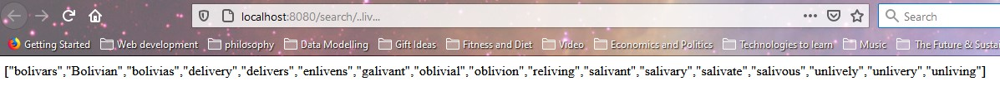
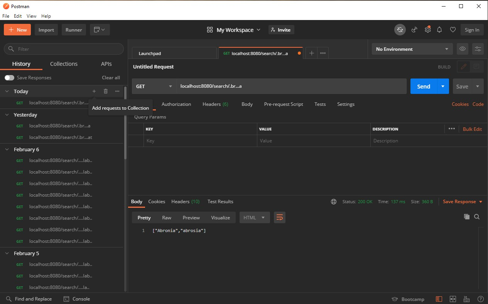

# Tilebag-API

Use this API to look up an English word if you know its length and zero or more of its letters. It could come in handy for dominating at hangman, for searching old moth-eaten documents for clues, or for cheating at crossword puzzles<sup>1</sup>.

## Setup

To use this app you'll need [Node.js](https://nodejs.org/en/) and a command-line interface (CLI). Clone this repo into a folder on your computer and navigate to that folder in your CLI. Type `npm install` and let the installer work its magic, then start the program by typing `node index`. You should see the message `Server listening on port 8080.`

To tell the API to use a port besides 8080, open the file `index.js` with a text editor. The last line of index.js is

```
app.listen(8080, () => {
console.log("Server listening on port 8080.");
});
```

Change the number `8080` to the address of any available port.

## Use

- To use a web browser to interface with the application, start the browser and open a new tab. In the navigation bar type

  `localhost:8080/search/`

  followed by the string you want to search for, where '.'s represent unknown characters. The API is case-sensitive. For example, to get a list of words that fit the pattern \_ _ liv _ \_ \_, type
  <br>
  `localhost:8080/search/..liv...`
  <br>
  An array of matching words will appear in the browser's window.



- To use [Postman](https://www.postman.com/), in the box to the left of the request field, select GET. In the request field type a URL like `localhost:8080/search/.br...a`, where ".br..a" is a search string as described above. Click **Send**.
  <br>
  
  <br>
  An array of matching words will appear in the **Body** section of the **Response** area.

  ## Technologies

  This project was built with Node.js version 14.15.0 and Express version 4.17.1. It uses the list of English words from [dwyl/english-words](https://github.com/dwyl/english-words). I'd like to extend my heartfelt thanks to anyone who worked on that project.
  <br>
  <sup>1</sup> Never cheat on a crossword puzzle unless it's a life-or-death situation.
